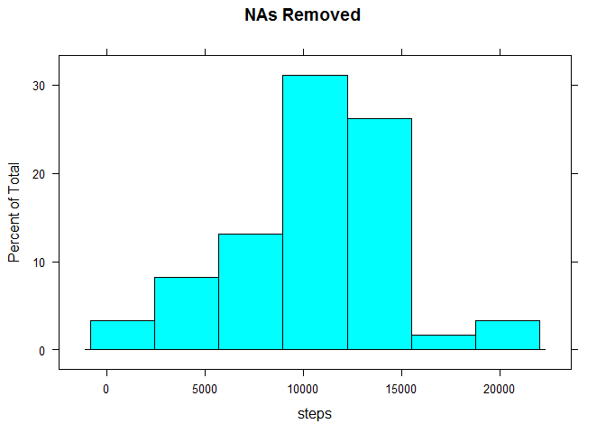
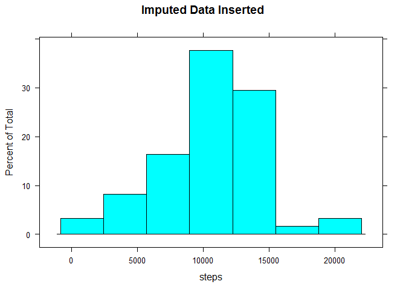
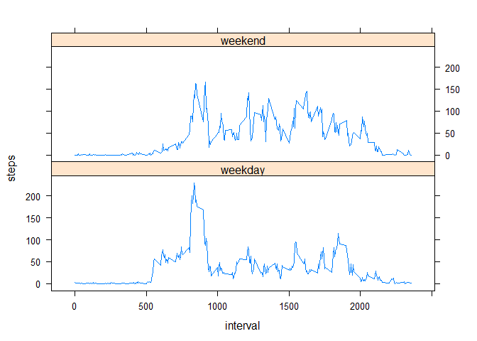
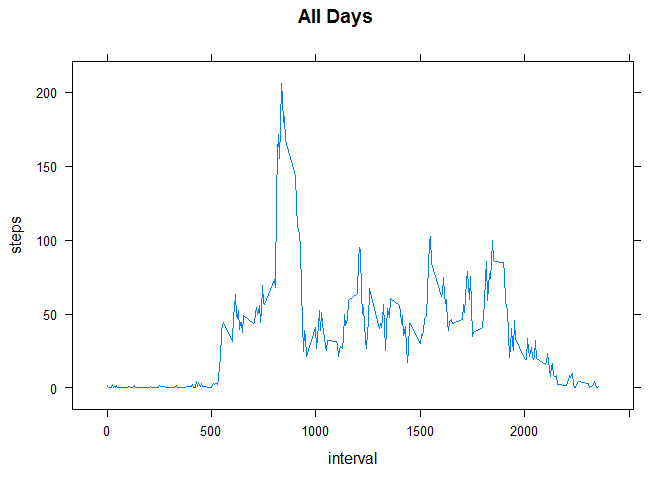

# Class 5 Progject 1
Dan Shalit  
April 14, 2017  


```r
knitr::opts_chunk$set(echo = TRUE)
```
##Introduction (shamelessly lifted from the assignment)

It is now possible to collect a large amount of data about personal movement using activity monitoring devices such as a Fitbit, Nike Fuelband, or Jawbone Up. These type of devices are part of the "quantified self" movement - a group of enthusiasts who take measurements about themselves regularly to improve their health, to find patterns in their behavior, or because they are tech geeks. But these data remain under-utilized both because the raw data are hard to obtain and there is a lack of statistical methods and software for processing and interpreting the data.

This assignment makes use of data from a personal activity monitoring device. This device collects data at 5 minute intervals through out the day. The data consists of two months of data from an anonymous individual collected during the months of October and November, 2012 and include the number of steps taken in 5 minute intervals each day.

##Obtaining and Storing the Data
The location of the data file is correct as of the date of this document. All efforts to suppress the messages from the library calls faliled so this section is more verbose than it needs to be.

```r
library(dplyr, quiet=TRUE)   
```

```
## 
## Attaching package: 'dplyr'
```

```
## The following objects are masked from 'package:stats':
## 
##     filter, lag
```

```
## The following objects are masked from 'package:base':
## 
##     intersect, setdiff, setequal, union
```

```r
library(lubridate, quiet=TRUE)
```

```
## 
## Attaching package: 'lubridate'
```

```
## The following object is masked from 'package:base':
## 
##     date
```

```r
library(lattice, quiet=TRUE)
library(knitr, quiet=TRUE)
```

```r
download.file("https://d396qusza40orc.cloudfront.net/repdata/data/activity.zip",
              "activity.csv.zip")
mydata<- tbl_df(read.csv(unzip("activity.csv.zip")))
mydata
```

```
## # A tibble: 17,568 × 3
##    steps       date interval
##    <int>     <fctr>    <int>
## 1     NA 2012-10-01        0
## 2     NA 2012-10-01        5
## 3     NA 2012-10-01       10
## 4     NA 2012-10-01       15
## 5     NA 2012-10-01       20
## 6     NA 2012-10-01       25
## 7     NA 2012-10-01       30
## 8     NA 2012-10-01       35
## 9     NA 2012-10-01       40
## 10    NA 2012-10-01       45
## # ... with 17,558 more rows
```

It is readily seen by inspection that the variables included in this dataset are:

- steps: Number of steps taking in a 5-minute interval (missing values are coded as NA)
- date: The date on which the measurement was taken in YYYY-MM-DD format
- interval: Identifier for the 5-minute interval in which measurement was taken

##Creating Two Datasets

The original data contains a substantial amount of missing data. Some of the analyses require that the NAs be replaced with imuputed data.  The seoond data frame concatnates the available data in the original set with the set of NAs replaced with imputed data.  See the section "NAs Imputed" for details of how this was accomplished.  

###Original Data

```r
daily<-group_by(mydata,date)
daily_total<- summarize(daily,sum(steps),na.rm = TRUE)
names(daily_total)<- c('date','steps')

daily_O<- summarize(daily_total,mean(steps,na.rm = TRUE),median(steps,na.rm = TRUE))
daily_O
```

```
## # A tibble: 1 × 2
##   `mean(steps, na.rm = TRUE)` `median(steps, na.rm = TRUE)`
##                         <dbl>                         <int>
## 1                    10766.19                         10765
```

```r
colnames(daily_O)<- c('mean steps','median steps')

intervals<-group_by(mydata,interval)
intervals_O <- summarize(intervals, mean(steps,na.rm = TRUE ),sd(steps,na.rm = TRUE))
colnames(intervals_O)<- c('interval','mean','sd')
```

###NAs Imputed
"There are three main problems that missing data causes: missing data can introduce a substantial amount of bias, make the handling and analysis of the data more arduous, and create reductions in efficiency." [Wikipedia](https://en.wikipedia.org/wiki/Imputation_(statistics). Of these, it is my opinion that only the first problem is by itself sufficient reason to impute missing data.  It may be permissible to impute missing data to allevieate either of the second or third reasons but only if it can be shown that the imputed data, at worst, do not do not degrade the quality of the analysis.

I have chosen to use the mean number of steps (averaged over all days) in each 5 minute interval, modified by adding a normal variate with standard deviation equal to the standard deviation for that interval. For intervals with a small number of steps, the negative noise can outweigh the mean number of steps so these values are then set to zero. 

```r
missing<- filter(mydata,is.na(steps))
unique(missing$date)
```

```
## [1] 2012-10-01 2012-10-08 2012-11-01 2012-11-04 2012-11-09 2012-11-10
## [7] 2012-11-14 2012-11-30
## 61 Levels: 2012-10-01 2012-10-02 2012-10-03 2012-10-04 ... 2012-11-30
```
There are 288 5-monute intervals in each calendar day. There are 8 days which have any missing data, and since there are 2304 = 8 x 288 total NAs in the data set, each of the days with NAs has NAs for all the intervals for that day.  So the following scheme replaces the NAs as described above.

```r
for(k in 0:7){
  missing[(288*k+1):(288*k+288),1]<- intervals_O[,2] + rnorm(1,sd = intervals_O$sd) 
}
negative <- which(missing[,1] < 0)
missing[negative,1]<- 0
```
#### Add the imputed values into the full data set

```r
fulldata <- rbind(missing, filter(mydata,!is.na(steps)))
fulldata<- arrange(fulldata,date,interval)

full<- group_by(fulldata,date)
full_total<- summarize(full,sum(steps))
names(full_total)<- c('date','steps')

full_I <- summarize(full_total,mean(steps),median(steps))
colnames(full_I)<- c('mean steps','median steps')
```

```r
daily_summary<- rbind(daily_O,full_I)
rownames(daily_summary)<- c('NAs Excluded','NAs Imputed' )
```

```
## Warning: Setting row names on a tibble is deprecated.
```

##Analysis Plan

The analysis of this data consists of the following:

1.	Code for reading in the dataset and/or processing the data
2.	Histogram of the total number of steps taken each day
3.	Mean and median number of steps taken each day
4.	Time series plot of the average number of steps taken[over what time period?]
5.	The 5-minute interval that, on average, contains the maximum number of steps
6.	Code to describe and show a strategy for imputing missing data
7.	Histogram of the total number of steps taken each day after missing values are imputed
8.	Panel plot comparing the average number of steps taken per 5-minute interval across weekdays and weekends
9.	All of the R code needed to reproduce the results (numbers, plots, etc.) in the report


##Results
###Steps Per Day With And Without Imputed Values For NAs
####1. Histogram of the total number of steps taken each day

```r
#hist(daily_total$steps,main = "Steps Per Day",xlab="steps",breaks=10)
plot<-histogram(~steps, data= daily_total,main = 'NAs Removed')
print(plot)
```

<!-- -->

```r
histogram(~steps, data= full_total,main = 'Imputed Data Inserted')
```

<!-- -->

####  2. Mean and median number of steps taken each day


```r
knames<-c('mean','median')
kable(daily_summary,col.names=knames,caption = "Statistics of Steps Per Day",align = rep("l",2),row.names = TRUE)
```


Table: Statistics of Steps Per Day

               mean       median 
-------------  ---------  -------
NAs Excluded   10766.19   10765  
NAs Imputed    10747.27   10600  

  Note that the near equality of the mean and median implies that the distribution of total steps per day has negligible skewness.
  
  Inculusion of imputed values appears to make a negligible difference in the distribuution of steps per day.  This is not surprising since the imputed data were constructed to mimic the distribution of observed data. 

###Average daily activity pattern

3. Time series plot of the number of steps taken per interval averaged over all days.


```r
daily<-group_by(daily,interval)
daily<- summarize(daily,mean(steps,na.rm = TRUE))
colnames(daily)<- c('interval','steps')
daily
```

```
## # A tibble: 288 × 2
##    interval     steps
##       <int>     <dbl>
## 1         0 1.7169811
## 2         5 0.3396226
## 3        10 0.1320755
## 4        15 0.1509434
## 5        20 0.0754717
## 6        25 2.0943396
## 7        30 0.5283019
## 8        35 0.8679245
## 9        40 0.0000000
## 10       45 1.4716981
## # ... with 278 more rows
```

```r
plot(daily$interval ,daily$steps,type="l",xlab = 'Interval',ylab='Steps')
```

<!-- -->

```r
#xyplot(steps~interval,data=daily,type = "l",main= 'All Days')
```

4. The 5-minute interval  that, on average, contains the maximum  number of steps is.

```r
#daily$steps
Max<-max(daily$steps)
maxout<-filter(daily,steps == Max)
maxout
```

```
## # A tibble: 1 × 2
##   interval    steps
##      <int>    <dbl>
## 1      835 206.1698
```

5. Create a new factor variable in the dataset with two levels, weekday and weekend, indicating whether a given date is a weekday or weekend day.


```r
Daysdata<-mutate(fulldata, day = weekdays(date(fulldata$date)))
wdays<- filter(Daysdata,!(day == "Saturday" |day=="Sunday"))
wend<- filter(Daysdata,day == "Saturday" |day=="Sunday")
wdays<- mutate(wdays,daytype = factor('weekday'))
wend<- mutate(wend ,daytype = factor('weekend'))
Alldays<-rbind(wdays,wend)
Alldays<-arrange(Alldays,date,interval)
Daytypes<- group_by(Alldays,interval,daytype)
AvgDaytypes<-summarise(Daytypes,mean(steps))
colnames(AvgDaytypes)<- c('interval','daytype', 'steps')  #needed because xyplot barfs on a two word colname.
xyplot(steps~interval|daytype,data=AvgDaytypes,type = "l",layout=c(1,2))
```

<!-- -->

```r
xyplot(steps~interval,data=daily,type = "l",main= 'All Days')
```

<!-- -->

For convenience I have reproduced the plot of steps per interval for the full data set here.  The weekday distribution and the overall distribution look very similar.  The weekend distribution is noticably different.  The weekday data has a stronger maximum peak, which makes sense as the time windows for exercise are narrower on weeldays due to scheduling constraints imposed by work schedules.  

Since the ratio of weekdays to weekend days is 5:2 the similarity of the overall distriution to the weekday distribution is to be expected.


